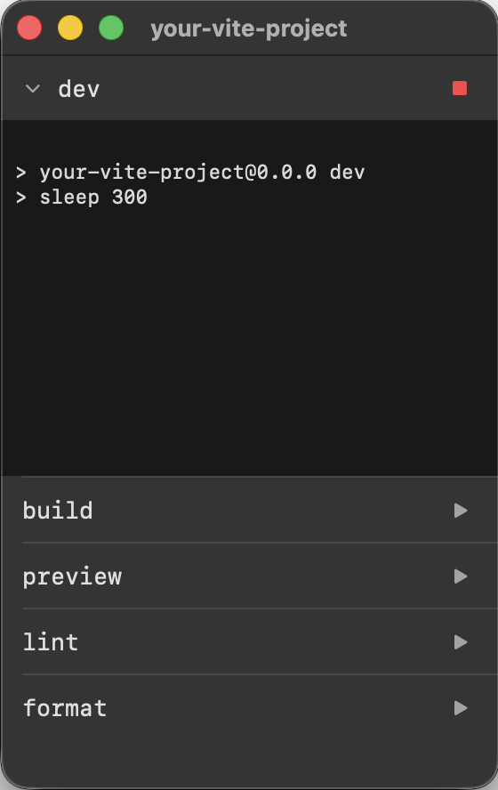

# npm remote control

A small macOS app that puts your npm scripts one click away, floating above your editor.

[Download](https://github.com/a10k/npm-remote-control/releases/latest/download/npm-remote-control.dmg) — macOS 26 or later, no installer.



---

## Setup

1. Open the DMG and drag npm remote control into your project folder, next to `package.json`.
2. Open the app.
3. Your scripts appear automatically.

---

## Interactions

| Action | Result |
|---|---|
| Click a script | Runs it and opens the terminal panel |
| Click a running script | Collapses or expands the terminal |
| Click the stop button | Kills the process tree |
| Right-click a running script | Kill |
| Right-click a failed script | Reset — clears the error badge |
| Edit `package.json` | The script list updates immediately |
| Quit the app | All running processes are stopped |

The window floats above other apps by default. Toggle this under the app menu.

---

## Build from source

```bash
git clone https://github.com/a10k/npm-remote-control
cd npm-remote-control
make build   # compiles the binary
make app     # → build/release/npm-remote-control.app
make dmg     # → build/release/npm-remote-control.dmg
```

Requires macOS 26 and Xcode 26.
